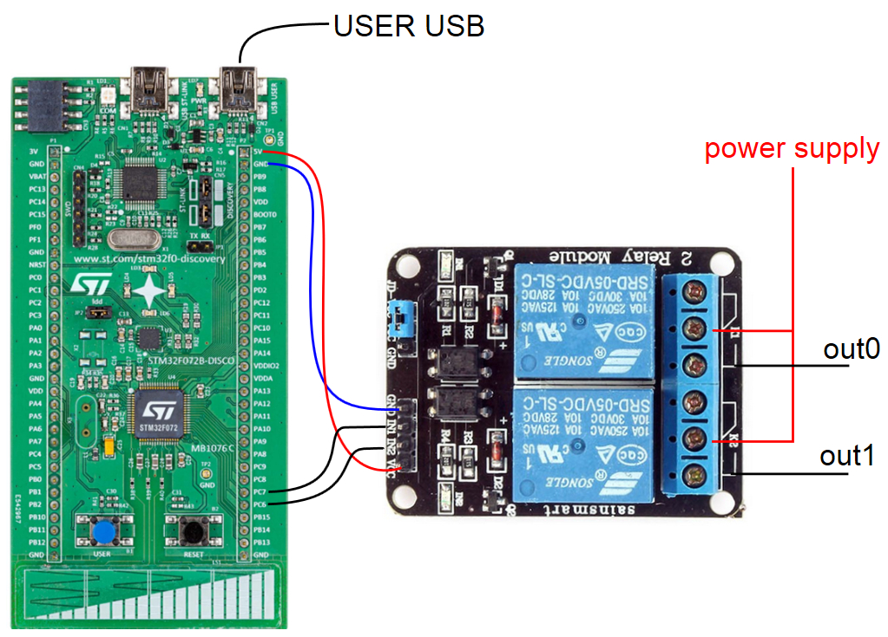
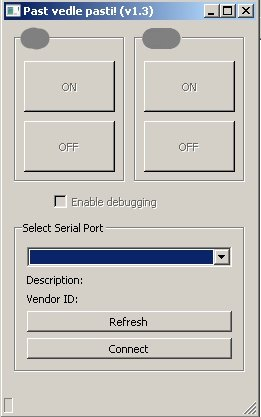
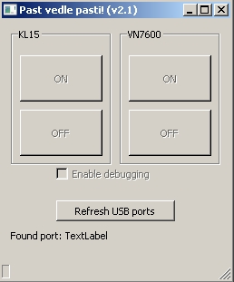

#  IOController-GUI - demo application
This is the demo application of GUI for project [IO-Controller-FW](https://github.com/chapppy/IO-Controller-FW "IO-Controller-FW"). This application connects to IOcontroller hardware and allow switch on/off of two releays.

## Instalation of STM32 Virtual COM Port Driver
The drive can be downloaded from [STM32 Virtual COM Port Driver](http://www.st.com/en/development-tools/stsw-stm32102.html "STM32 Virtual COM Port Driver"), There is guide for instalation too.

## Connection of GUI to device
The GUI must be connected to VCP with vendor description "STMicroelectronics Virtual COM Port" in order to start the communication.

note: the port must be manualy select on version on main branch. The port is detected automaticaly on "autoconection" branch.

# Wiring for this example
The [32F072BDISCOVERY](http://www.st.com/en/evaluation-tools/32f072bdiscovery.html "32F072BDISCOVERY") and two realy board was used for this example.

# Example of finall GUI

